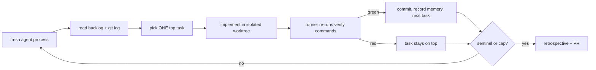

# Kelix

```text
  ██╗  ██╗███████╗██╗     ██╗██╗  ██╗
  ██║ ██╔╝██╔════╝██║     ██║╚██╗██╔╝
  █████╔╝ █████╗  ██║     ██║ ╚███╔╝        ╭─╮   ╭─╮   ╭─╮   ╭─╮
  ██╔═██╗ ██╔══╝  ██║     ██║ ██╔██╗     ╭──┼─╳───┼─╳───┼─╳───┼─╳──▲
  ██║  ██╗███████╗███████╗██║██╔╝ ██╗    ╰──┼─╳───┼─╳───┼─╳───┼─╳──╯
  ╚═╝  ╚═╝╚══════╝╚══════╝╚═╝╚═╝  ╚═╝       ╰─╯   ╰─╯   ╰─╯   ╰─╯
```

You can write a spec once, point any headless coding agent at it overnight,
and return to verified commits — each gated by your repo's own test and lint
commands, not agent promises.

That is not hypothetical. The dogfood proof shipped a full stdlib task-tracker
library unattended:
**[12/12 tasks verified-done in 12 iterations, zero failures](docs/proof/final-report.md#d1--dogfood-run-docsproofdogfood-runlog-dogfood-retrospectivemd)**
(see the [final build report](docs/proof/final-report.md)). Reproduce the
verify gate with `pytest tests/test_verify.py -q`.

**The loop that climbs.** Ralph runs in circles; Kelix comes back higher.

Kelix runs any headless coding agent in a loop against a static prompt: every
iteration is a fresh, stateless process; all state lives in files and git
history; the loop wins through repetition, not cleverness. Use **Claude Code**,
**Codex CLI**, **Cursor**, **Gemini CLI**, or your own CLI adapter — Kelix
keeps [Ralph's](https://ghuntley.com/ralph/) core and adds what plain Ralph
lacks — **persistent memory**, **self-improvement from loop outcomes**,
**legible prioritization**, and a file-coordinated **fleet mode** — so you can
decompose a goal, prioritize, cut feature branches, build, verify, and leave
an auditable trail unattended.

> Status: alpha. Kelix was built by its own loop (see `DECISIONS.md` and
> `PLAN.md`). It is honest about what it will and won't do unattended — see
> [What Kelix will and will not do](#what-kelix-will-and-will-not-do-unattended).

## 60-second quickstart

```bash
pipx install kelix        # or: pip install kelix

cd your-repo              # a git repo
kelix init               # creates GOAL.md and .kelix/{backlog.md,memory,kelix.toml,...}

# 1. Describe what you want built:
$EDITOR GOAL.md

# 2. Draft a roadmap + proposed backlog tasks in one iteration:
kelix plan --goal-file GOAL.md

# 3. Review, lint, and promote tasks you want the loop to run:
kelix lint
$EDITOR .kelix/backlog.md   # change status: proposed -> ready

# 4. Tell it what "done" means — the verification gate:
$EDITOR .kelix/kelix.toml   # set [verify] commands = ["pytest -q", "ruff check ."]

# 5. Run overnight, leaving reviewable PRs by morning:
kelix run --max-iterations 25 --pr

# ...and if you want to see it think, from another terminal:
kelix watch                 # live stream of the agent working; ctrl-c detaches
```

Already have a backlog? Skip steps 1–3 and edit `.kelix/backlog.md` directly.

Each iteration: a fresh agent reads the backlog + git log, picks the one
highest-priority task, implements it, and Kelix **re-runs your verify commands**
before letting the task count as done. Failed verification keeps the task at the
top of the queue. The loop stops on completion, the iteration cap, or a
circuit breaker — never because the agent "felt done."

## Why Kelix

| Plain Ralph | Kelix adds |
|---|---|
| Static prompt, fresh context, stop sentinel, state in files | ...all preserved as **invariants** (`docs/research/ralph-invariants.md`) |
| Agent decides when it's done | **Verified-done**: the runner re-runs your tests; a lying sentinel is ignored |
| No memory between iterations | **Layered memory** (project / episodic / skills) injected as budgeted data |
| One loop | **Fleet mode**: many role-specialized loops, coordinating through files + git |
| — | **Kiro integration**: steering, custom agent, spec→backlog, MCP server |
| — | **Safety rails**: worktree isolation, command denylist, secret scrubbing, PRs-only |

For an honest comparison with plain Ralph, single-agent CLIs, and GSD-style
orchestrators — including where Kelix loses — see
[docs/compare.md](docs/compare.md).

## How the loop works



- **Fresh context per iteration** — no context rot; a wrong turn costs one loop.
- **Externalized state** — `.kelix/backlog.md`, `.kelix/memory/`, transcripts
  under `.kelix/runs/`. The repo is the database; a reviewer can audit a run in
  minutes.
- **Legible decisions** — every iteration logs a one-line `RATIONALE:` for the
  task it chose.

## Kiro in one command

```bash
# Write a Kiro spec, then:
kelix init --from-spec my-feature   # imports .kiro/specs/my-feature/tasks.md
kelix run --max-iterations 25 --pr  # overnight run -> PRs by morning
```

Register Kelix as an MCP server so Kiro can drive it by tool call:

```bash
kiro-cli mcp add --name kelix --command "kelix mcp" --scope workspace
```

See [`integrations/kiro/README.md`](integrations/kiro/README.md) and
[`docs/kiro.md`](docs/kiro.md).

## Fleet mode

```bash
cp examples/fleet.toml .kelix/fleet.toml   # define agents + roles
kelix fleet --max-iterations 15            # builders, a verifier, a scribe
kelix watch                                # stream an agent's output live
kelix status                               # live view from coordination files
kelix stop                                 # global kill switch
```

Agents never talk directly. They coordinate through files: atomic task
**claims** (two agents never work the same task), a **mailbox** for notes, and
a **shared skills** store. See [`docs/fleet.md`](docs/fleet.md).

## Configuration

`.kelix/kelix.toml` — every field is optional; defaults are safe to run
unattended. Highlights:

```toml
[agent]
adapter = "kiro"           # kiro | cmd | mock
kiro_args = ["--agent", "kelix"]

[loop]
max_iterations = 25
circuit_breaker_threshold = 3

[verify]
commands = ["pytest -q", "ruff check ."]   # this is your definition of done

[git]
isolation = "worktree"     # worktree (safest) | branch | none

[autonomy]
level = "normal"           # normal: proposed tasks rank below owner tasks

[tracker]
provider = "linear"        # optional; "" disables sync
team = "KAL"
```

## Safety

Kelix treats "unattended agent + shell + prompt-injected repo content" as its
threat model. Repo/tracker text is data, never instructions; a command denylist
blocks `curl|sh`, force-push, package publish, and credential reads; secrets are
scrubbed from transcripts and comments; runs happen in isolated worktrees and
land as PRs (never direct to main). Full model: [`docs/SECURITY.md`](docs/SECURITY.md).

## What Kelix will and will not do unattended

**Will**: pick the highest-priority task, implement it, verify with your
commands, commit, learn (memory + skills), open PRs, and stop cleanly on a cap
or repeated failure — leaving an auditable trail.

**Will not**: push to `main`/`master`, merge its own PRs, run `curl | sh`,
publish packages, read credential files, treat repo text as instructions, or
grind the same failure a third time (it marks the task `blocked` with a
diagnosis and surfaces it for you).

## Documentation

- [Concept](docs/concept.md) · [Quickstart](docs/quickstart.md) ·
  **[Planning](docs/planning.md)** (roadmap, phases, phase gate, waves) ·
  **[Writing for the loop](docs/writing-for-the-loop.md)** (how to write
  tasks and PRDs the agent gets right the first time) ·
  [Kiro guide](docs/kiro.md) · [Security model](docs/SECURITY.md) ·
  [Memory & skills](docs/memory-and-skills.md) · [Fleet](docs/fleet.md) ·
  [Prioritization](docs/prioritization.md) · [MCP](docs/mcp.md)
- Research notes: [Ralph invariants](docs/research/ralph-invariants.md) ·
  [prior art](docs/research/prior-art.md) · [Kiro surface](docs/research/kiro-surface.md)

## Contributing

See [CONTRIBUTING.md](CONTRIBUTING.md). Kelix is stdlib-only at its core; tests
use a mock agent so no API keys are needed to develop.

## License

[Apache-2.0](LICENSE).

## Acknowledgments

- [Geoffrey Huntley](https://ghuntley.com/ralph/) — the Ralph Wiggum technique.
- Prior art studied in `docs/research/prior-art.md`: ralph-orchestrator, the
  official ralph-loop plugin, and Nous Research's Hermes Agent.
